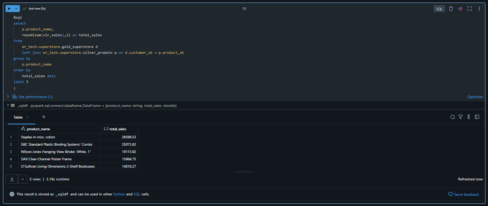
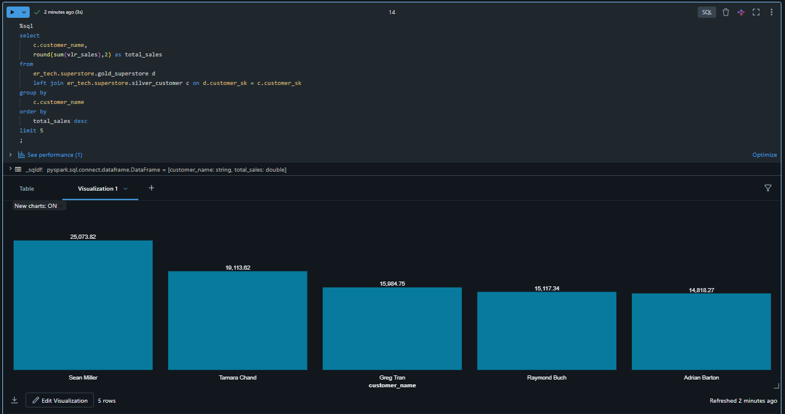
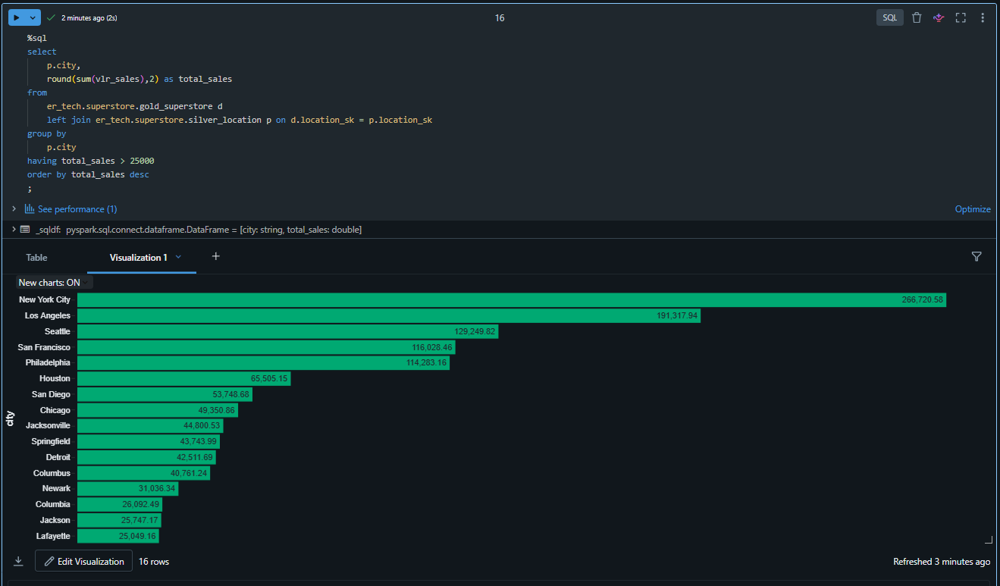

## SuperstoreSalesPerformance

### Summary
End-to-end data project using a retail dataset, covering data ingestion, cleansing, and transformation in Databricks, data modeling with SQL and version control with Git. The project aims to generate strategic insights and key performance indicators (KPIs) to support data-driven decision-making.

### Business Problem
- A retail company wants to understand its sales performance and profitability.

### Management needs answers to:
- Which products generate the most sales?
- Which customer generate the most sales?
- Which city perform best with sales most 20.000?

### Result 
##1

##2

##3
